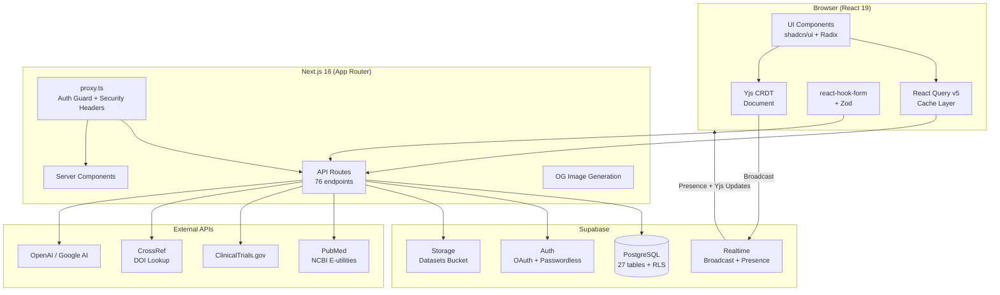
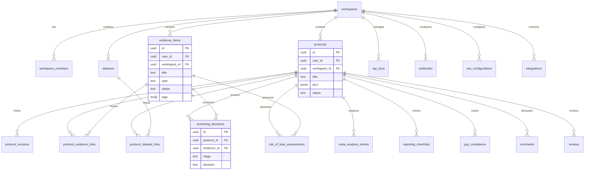
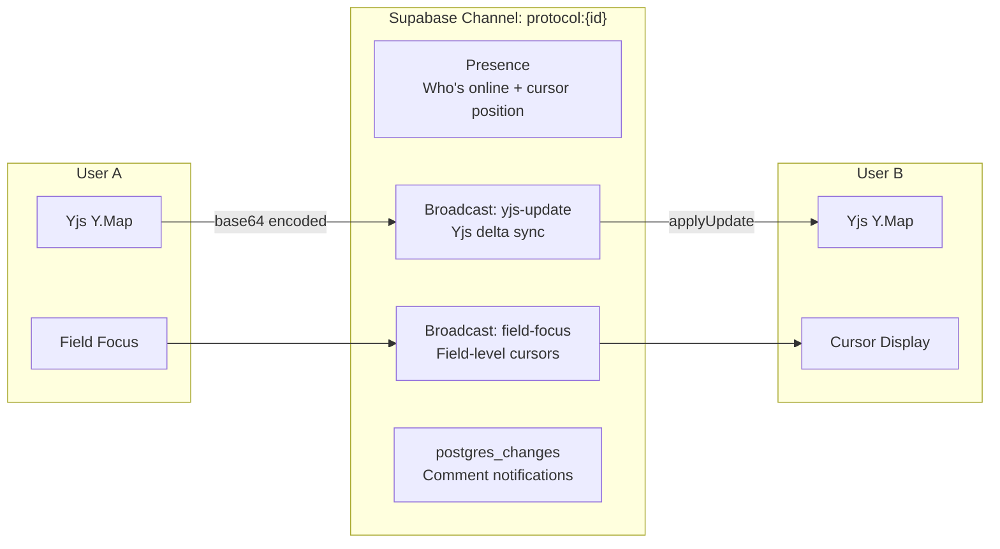

# Architecture

VaxEvidence is a Real-World Evidence (RWE) platform for vaccine research scientists. This document describes the system architecture, data model, and key design decisions.

## System Overview



## Data Model



## Authentication & Authorization

### Auth Flow

1. **Supabase Auth** handles OAuth (Google, GitHub) and passwordless (magic link) flows
2. `proxy.ts` intercepts all requests matching `/app/*`, `/auth`, `/demo/*`, `/api/*`
3. Session refresh via `updateSession()` using `@supabase/ssr` cookie management
4. Unauthenticated `/app/*` requests redirect to `/auth`; authenticated `/auth` requests redirect to `/app`

### Security Headers

`proxy.ts` applies hardened headers to every response:

- `Content-Security-Policy` restricting connect-src to `*.supabase.co`
- `X-Frame-Options: DENY`
- `X-Content-Type-Options: nosniff`
- `Referrer-Policy: strict-origin-when-cross-origin`
- `Permissions-Policy` disabling camera, microphone, geolocation

### Row-Level Security

All tables have RLS policies enforced at the PostgreSQL level. Two access patterns:

| Pattern                        | Client                      | Use Case                                         |
| ------------------------------ | --------------------------- | ------------------------------------------------ |
| `createServerSupabaseClient()` | User session (SSR, cookies) | Server Components needing user's own RLS context |
| `getSupabaseAdmin()`           | Service role (bypasses RLS) | API routes with explicit auth checks             |

API routes always call `getServerUser()` first, then use `getSupabaseAdmin()` for queries that need cross-user access (e.g., workspace-scoped data).

## Data Access Layer

### Browser CRUD Modules

`lib/supabase/*.ts` contains 18 domain-specific CRUD modules. Each follows the same pattern:

```typescript
// Every module exports functions like:
export async function getEvidenceList(params) {
  const client = getClient();       // SSR-aware browser client
  if (!client) return notConfigured<Evidence[]>();
  return safeCall(() =>
    client.from("evidence_items").select("*")...
  );
}
```

**Important:** Browser CRUD modules use `@supabase/ssr` and rely on browser cookies. They cannot be used in API routes.

### Server Data Access

API routes use `getSupabaseAdmin()` (service role singleton) with inline queries:

```typescript
export async function GET(request: NextRequest) {
  const user = await getServerUser();
  if (!user)
    return NextResponse.json({ error: "Unauthorized" }, { status: 401 });

  const supabase = getSupabaseAdmin();
  const { data, error } = await supabase
    .from("protocols")
    .select("*")
    .eq("user_id", user.id);
  // ...
}
```

## Real-Time Collaboration

### Architecture

Real-time collaboration uses three Supabase Realtime features on a single channel per protocol (`protocol:{id}`):



### Yjs Transport

`SupabaseYjsProvider` (~115 lines) uses Supabase Broadcast as the Yjs transport layer, eliminating the need for a dedicated WebSocket server:

- **Delta sync:** Local Yjs updates are base64-encoded and broadcast. Peers apply updates with origin tracking to prevent echo loops.
- **Late joiner sync:** New peers broadcast `request-sync`; existing peers respond with full state via `Y.encodeStateAsUpdate()`.
- **Field model:** Uses `Y.Map<string>` (not `Y.Text`) because PICO fields are short strings where last-writer-wins is acceptable.

### Form Bridge

`YjsFormBridge` provides bidirectional sync between Yjs documents and `react-hook-form`:

- Uses `LOCAL_ORIGIN` tag to distinguish local vs remote updates
- Prevents infinite loops via origin tracking

## Export Pipeline

All exports are server-side, generated in API route handlers:

| Export         | Format     | Generator            | Route                            |
| -------------- | ---------- | -------------------- | -------------------------------- |
| Protocol       | PDF        | jsPDF                | `/api/export/protocol/[id]`      |
| Protocol       | Word       | docx                 | `/api/export/protocol/[id]`      |
| FDA IND        | PDF + Word | jsPDF / docx         | `/api/export/protocol/[id]/ind`  |
| eCTD Module 5  | PDF + Word | jsPDF / docx         | `/api/export/protocol/[id]/ectd` |
| SDTM Templates | ZIP (CSVs) | papaparse + archiver | `/api/export/protocol/[id]/sdtm` |
| Bibliography   | Multiple   | citation-js          | `/api/export/bibliography`       |
| PRISMA Diagram | PDF        | jsPDF                | Built into screening             |
| Activity Log   | CSV + PDF  | papaparse / jsPDF    | `/api/export/activity/*`         |
| Workspace      | ZIP        | archiver             | `/api/export/workspace`          |

### Regulatory Data Mapping

```
Protocol PICO
    |
    +---> IND Sections (21 CFR 312.23)
    |     10 sections auto-populated from protocol fields
    |
    +---> eCTD Module 5 (ICH M4E(R2))
    |     15 sections + screening data integration
    |
    +---> SDTM Domains (CDISC v3.3)
          10 domains, trial design auto-populated
          via lib/regulatory/sdtm-trial-design.ts
```

## Public REST API

Phase 12 added a versioned public API at `/api/v1/`:

- **Authentication:** API key in `x-api-key` header (not Supabase cookies)
- **Rate limiting:** Per-key request tracking via `api_request_logs`
- **Endpoints:** Protocols, evidence, datasets, screening (CRUD)
- **Documentation:** OpenAPI spec served at `/api/v1/docs`

`proxy.ts` passes `/api/v1` requests through without session checks since they use API key auth.

## Testing Strategy

Three-tier testing pyramid:

```
         /\
        /  \        63 E2E tests (Playwright)
       /    \       Critical user flows
      /------\
     /        \     60 integration tests (vitest)
    /          \    RLS policies, CRUD, data integrity
   /------------\
  /              \  ~1,400 unit tests + 51 benchmarks
 /                \ Components, utils, validators, API routes
/------------------\
```

| Tier        | Count  | Framework    | Config                         |
| ----------- | ------ | ------------ | ------------------------------ |
| Unit        | ~1,400 | vitest       | `vitest.config.ts`             |
| Benchmark   | 51     | vitest bench | `vitest.config.ts`             |
| Integration | 60     | vitest       | `vitest.integration.config.ts` |
| E2E         | 63     | Playwright   | `playwright.config.ts`         |

Integration tests run against a real Supabase instance and use `describe.skipIf(!isConfigured)` to skip gracefully without credentials.

## Key Design Decisions

### Why Yjs over Operational Transform?

Yjs CRDTs provide conflict-free merging without a central server. Combined with Supabase Broadcast (which is already in the stack for presence), this eliminates the need for a dedicated OT server. The tradeoff is that CRDTs have higher memory overhead, but PICO protocol fields are small enough that this is negligible.

### Why Custom SVG Forest Plots?

recharts lacks support for confidence interval whiskers, which are essential for meta-analysis forest plots. A custom SVG implementation (~300 lines) provides exact control over the statistical visualization without adding a specialized charting dependency.

### Why Not react-flow for PRISMA Diagrams?

The PRISMA flow diagram has a fixed, standardized structure (identification -> screening -> eligibility -> included). Since nodes don't need to be draggable or dynamically positioned, a pure Tailwind CSS implementation is simpler and avoids the ~200KB react-flow dependency.

### Why Separate Browser and Server Supabase Clients?

`@supabase/ssr` provides cookie-based session management for the browser client, which is essential for SSR hydration. However, API routes run in a server-only context where cookies from `@supabase/ssr` are not available. Using a service role admin client in API routes with explicit `getServerUser()` checks provides reliable auth without cookie gymnastics.

### Why proxy.ts Instead of middleware.ts?

Next.js 16 deprecated the `middleware.ts` convention in favor of `proxy.ts`. The function is named `proxy` (not `middleware`) and serves the same purpose: route interception, session refresh, and security header injection.
