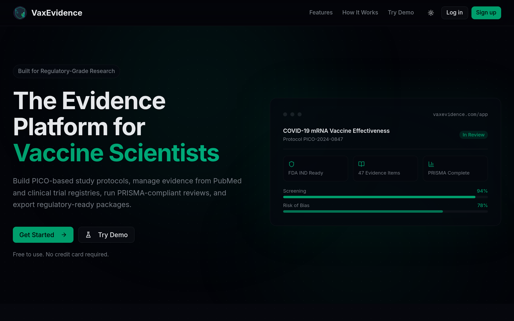
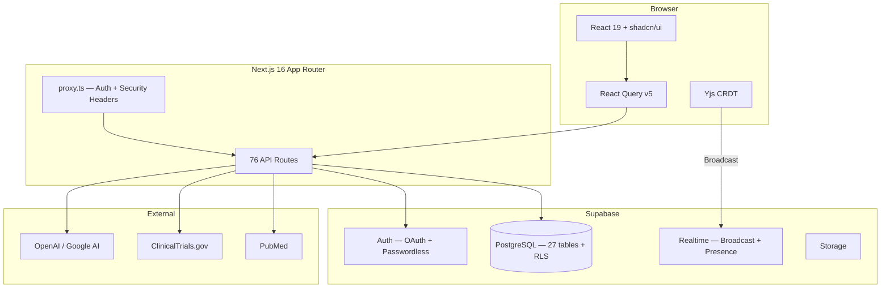

# VaxEvidence

**Real-World Evidence platform for vaccine research scientists.**

[](https://github.com/VaxEvidence/vax-evidence-dev/actions/workflows/ci.yml)


> [**Live Demo**](https://vaxevidence-dev.vercel.app/demo) — No sign-up required. Pre-loaded with sample vaccine research data.


<p align="center">
  
</p>

---

## Why This Exists

Vaccine researchers spend weeks manually assembling study protocols, screening literature, and formatting regulatory submissions. VaxEvidence automates the entire pipeline — from PICO protocol design through PRISMA systematic review to FDA/EMA export — in a single collaborative platform. This is not a todo app with a database; it is a domain-specific tool built for the regulatory complexity of health-tech.

## Key Features

| Feature                       | What It Does                                                                    |
| ----------------------------- | ------------------------------------------------------------------------------- |
| **PICO Protocol Builder**     | Structured study design with version history, diff viewer, and template library |
| **PRISMA Screening Pipeline** | 4-stage systematic review with duplicate detection (DOI/PMID/fuzzy title)       |
| **Risk-of-Bias Assessment**   | RoB 2 (RCTs) and ROBINS-I (observational) with traffic-light visualizations     |
| **Meta-Analysis**             | Custom SVG forest plots with CI whiskers, subgroup analysis, pooled effects     |
| **Regulatory Exports**        | FDA IND (21 CFR 312.23), eCTD Module 5 (ICH M4E), CDISC SDTM templates          |
| **Real-Time Collaboration**   | Yjs CRDT editing, presence cursors, threaded comments with @mentions            |

## Architecture



See [ARCHITECTURE.md](ARCHITECTURE.md) for the full system design, data model, and design decisions.

## Tech Stack

| Layer           | Technology                                             |
| --------------- | ------------------------------------------------------ |
| Framework       | Next.js 16 (App Router), React 19, TypeScript (strict) |
| Styling         | Tailwind CSS v4, OKLCH color space, dark mode default  |
| UI              | shadcn/ui (New York) + Radix UI + Lucide icons         |
| Database        | Supabase (PostgreSQL + Auth + RLS + Storage)           |
| Data Fetching   | @tanstack/react-query v5                               |
| Forms           | react-hook-form + Zod                                  |
| Real-Time       | Yjs (CRDT) + Supabase Realtime (Broadcast + Presence)  |
| AI              | Vercel AI SDK v6, OpenAI, Google AI                    |
| Exports         | jsPDF, docx, papaparse, exceljs, citation-js, archiver |
| Charts          | recharts + custom SVG (forest plots)                   |
| Monitoring      | Sentry (error tracking + source maps)                  |
| Testing         | vitest, Playwright                                     |
| Package Manager | pnpm                                                   |

## Quick Start

```bash
git clone https://github.com/VaxEvidence/vax-evidence-dev.git
cd vax-evidence-dev
pnpm install
cp .env.test.example .env.local   # Add your Supabase credentials
pnpm dev                          # http://localhost:3000
```

The demo mode at `/demo` works without Supabase credentials.

## Testing

```bash
pnpm test              # ~1,400 unit tests + 51 benchmarks (vitest)
pnpm test:integration  # 60 integration tests against real Supabase
pnpm test:e2e          # 63 E2E tests (Playwright)
pnpm typecheck         # TypeScript strict mode
pnpm lint              # ESLint
```

## Project Stats

```
Components       136    (55 shadcn/ui + 81 feature)
API Routes        76    (CRUD, export, search, AI, public REST API)
CRUD Modules      18    (one per domain table)
DB Tables         27    (+ RLS on all)
DB Migrations     23
Unit Tests     1,400+
Integration       60    (RLS policies, CRUD, data integrity)
E2E Tests         63    (Playwright)
Benchmarks        51    (perf regression detection)
Zod Schemas       11    (runtime validation)
Export Formats     9    (PDF, Word, CSV, Excel, ZIP, BibTeX, RIS, APA, MLA)
```

## Honest Assessment

See [ASSESSMENT.md](ASSESSMENT.md) for a candid evaluation of what works well, what doesn't, and known technical debt. No sugarcoating.

## Documentation

| Document                           | Description                                 |
| ---------------------------------- | ------------------------------------------- |
| [ARCHITECTURE.md](ARCHITECTURE.md) | System design, data model, design decisions |
| [CONTRIBUTING.md](CONTRIBUTING.md) | Setup, conventions, PR process              |
| [SECURITY.md](SECURITY.md)         | Security measures and limitations           |
| [ROADMAP.md](ROADMAP.md)           | Full product roadmap (12 phases complete)   |
| [ASSESSMENT.md](ASSESSMENT.md)     | Honest technical assessment                 |
| [docs/](docs/)                     | Performance benchmarks, PRDs, QA checklists |

## License

[MIT](LICENSE)
