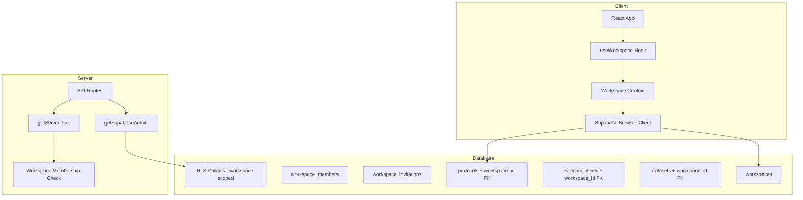

# PRD: VaxEvidence — Quality Infrastructure + Teams & RBAC

> **Status:** Draft
> **Author:** Pyae Sone (Seon)
> **Date:** 2026-02-20
> **Last Updated:** 2026-02-20

---

## 1. Problem Statement

### What problem are we solving?

VaxEvidence has a working MVP with 7 major feature areas (protocols, evidence, datasets, collaboration, exports, templates, search). However, it lacks quality infrastructure (tests, CI, type safety enforcement) and is single-user — no team support. Without teams and RBAC, no organization will adopt or pay for the platform. Without tests and CI, every new feature risks breaking existing functionality.

### Who has this problem?

Vaccine research teams (3-15 people) at pharma companies, biotech firms, and academic institutions who need to collaboratively design study protocols, manage evidence, and produce regulatory-ready reports. They need role-based access (leads write, reviewers review, viewers view) and audit trails for FDA/EMA compliance.

### Why now?

The MVP is feature-complete for single-user workflows. Adding more features without tests compounds technical debt. Teams & RBAC is the #1 blocker for monetization per the product roadmap.

---

## 2. Success Criteria

### Primary Metric

Multiple users can collaborate on protocols within a shared workspace with role-based permissions, backed by 80%+ test coverage on critical paths and a green CI pipeline.

### Secondary Metrics

- [ ] CI pipeline runs lint + type-check + unit tests + build on every push
- [ ] Zero TypeScript build errors (remove `ignoreBuildErrors: true`)
- [ ] 80%+ unit test coverage on `lib/supabase/*.ts` CRUD modules and `lib/validators/*.ts`
- [ ] All API routes have integration tests (happy path + auth check + error cases)
- [ ] E2E smoke tests pass in CI
- [ ] Team invite flow works end-to-end (invite → accept → see shared data)
- [ ] RLS policies enforce workspace-level data isolation

### What does "done" look like?

A researcher creates a workspace, invites 3 colleagues with different roles (Lead, Reviewer, View-only). Each sees only their workspace's data. The Lead creates protocols and evidence. The Reviewer can comment and review but not edit. The Viewer can read but not modify. All of this is protected by RLS at the database level, with a full test suite and CI pipeline preventing regressions.

---

## 3. User Stories & Acceptance Criteria

### Phase A: Quality Infrastructure

#### Story A1: Unit Test Framework

**As a** developer, **I want** a working vitest setup with test scripts, **so that** I can write and run unit tests locally and in CI.

**Acceptance Criteria:**

- [ ] Given the project, when I run `pnpm test`, then vitest executes and reports results
- [ ] Given a test file in `__tests__/`, when vitest runs, then it resolves `@/*` path aliases correctly
- [ ] Given the Zod validators in `lib/validators/`, when tested, then all schemas validate correct input and reject invalid input
- [ ] Given the CRUD modules in `lib/supabase/`, when tested with mocked Supabase client, then all query functions return expected shapes

#### Story A2: CI Pipeline

**As a** developer, **I want** GitHub Actions running lint + type-check + test + build on every push, **so that** regressions are caught before merge.

**Acceptance Criteria:**

- [ ] Given a push to any branch, when CI triggers, then it runs: `pnpm lint`, `tsc --noEmit`, `pnpm test`, `pnpm build`
- [ ] Given a failing test, when CI runs, then the pipeline fails and reports which test broke
- [ ] Given the E2E tests, when CI runs, then Playwright smoke tests execute (with Supabase mocked or skipped gracefully)

#### Story A3: Fix TypeScript Build Errors

**As a** developer, **I want** `ignoreBuildErrors: false` in next.config.mjs, **so that** type errors are caught at build time.

**Acceptance Criteria:**

- [ ] Given `ignoreBuildErrors` removed/set to false, when `pnpm build` runs, then it completes with zero TS errors
- [ ] Given any new code, when it has type errors, then the build fails (preventing deploy of broken code)

#### Story A4: Environment Template

**As a** new developer, **I want** a `.env.example` file, **so that** I know which environment variables to configure.

**Acceptance Criteria:**

- [ ] Given `.env.example` in the repo root, when a dev clones the repo, then they see all required/optional vars with descriptions
- [ ] Given `.env.example`, when compared to actual usage in code, then all referenced env vars are documented

### Phase B: Teams & RBAC

#### Story B1: Workspace Creation

**As a** researcher, **I want to** create a workspace for my team, **so that** we can collaborate on protocols in an isolated space.

**Acceptance Criteria:**

- [ ] Given an authenticated user, when they create a workspace, then it appears in their workspace list
- [ ] Given a new user with no workspaces, when they first log in, then a "Personal" workspace is auto-created
- [ ] Given a workspace, when viewing data, then only that workspace's protocols/evidence/datasets are visible
- [ ] Error: when workspace name is empty, then form shows validation error

#### Story B2: Team Invitations

**As a** workspace admin, **I want to** invite team members by email, **so that** they can join my workspace.

**Acceptance Criteria:**

- [ ] Given an admin, when they enter a colleague's email and select a role, then an invitation is created
- [ ] Given an invited user who already has an account, when they log in, then they see the pending invitation
- [ ] Given an invited user, when they accept the invitation, then they become a member with the assigned role
- [ ] Given an invited user, when they decline, then the invitation is removed
- [ ] Error: when inviting an email already in the workspace, then show "Already a member"

#### Story B3: Role-Based Access Control

**As a** workspace admin, **I want** different permission levels for team members, **so that** data integrity is maintained.

**Roles & Permissions:**

| Permission                | Admin | Lead Researcher | Reviewer | View-only |
| ------------------------- | ----- | --------------- | -------- | --------- |
| Manage workspace settings | Yes   | No              | No       | No        |
| Invite/remove members     | Yes   | No              | No       | No        |
| Change member roles       | Yes   | No              | No       | No        |
| Create protocols          | Yes   | Yes             | No       | No        |
| Edit protocols            | Yes   | Yes             | No       | No        |
| Delete protocols          | Yes   | Yes (own)       | No       | No        |
| Add/edit evidence         | Yes   | Yes             | No       | No        |
| Upload datasets           | Yes   | Yes             | No       | No        |
| Create comments           | Yes   | Yes             | Yes      | No        |
| Submit reviews            | Yes   | Yes             | Yes      | No        |
| View all data             | Yes   | Yes             | Yes      | Yes       |
| Export reports            | Yes   | Yes             | Yes      | Yes       |

**Acceptance Criteria:**

- [ ] Given a View-only member, when they try to create a protocol, then the UI hides the create button and the API returns 403
- [ ] Given a Reviewer, when they view a protocol, then they see comment/review UI but no edit buttons
- [ ] Given an Admin, when they view member list, then they can change any member's role
- [ ] Given a Lead Researcher, when they delete a protocol, then only their own protocols can be deleted (not others')

#### Story B4: Workspace Data Isolation

**As a** workspace member, **I want** my workspace data completely separate from other workspaces, **so that** there is no data leakage.

**Acceptance Criteria:**

- [ ] Given user A in Workspace 1 and user B in Workspace 2, when user A queries protocols, then they see zero of Workspace 2's data
- [ ] Given a user in multiple workspaces, when they switch workspaces, then all data refreshes to show the selected workspace's content
- [ ] Given RLS policies, when a direct Supabase query is attempted with a different workspace_id, then the query returns empty results
- [ ] Given a protocol created in Workspace 1, when accessed via API with Workspace 2 context, then 404 is returned

#### Story B5: Workspace Switcher UI

**As a** user in multiple workspaces, **I want to** switch between them easily, **so that** I can work with different teams.

**Acceptance Criteria:**

- [ ] Given a user in 3 workspaces, when they click the workspace switcher in the sidebar, then all 3 workspaces are listed
- [ ] Given workspace switch, when selected, then the URL/context updates and all data reloads
- [ ] Given the current workspace, when displayed in the sidebar, then it shows workspace name and user's role badge

---

## 4. Technical Architecture

### Stack Decision

| Layer    | Choice                             | Why                                             |
| -------- | ---------------------------------- | ----------------------------------------------- |
| Frontend | Next.js 16 + React 19 + TypeScript | Already in use, App Router                      |
| Backend  | Next.js API Routes + Supabase      | Already in use, serverless                      |
| Database | Supabase PostgreSQL + RLS          | Already in use, RLS for security                |
| Auth     | Supabase Auth (@supabase/ssr)      | Already in use, session-based                   |
| Testing  | vitest (unit) + Playwright (E2E)   | vitest for speed, Playwright already configured |
| CI/CD    | GitHub Actions                     | Standard, free for public repos                 |

### Architecture Diagram



### Database Schema Changes

#### New Tables

```sql
-- Workspaces
CREATE TABLE workspaces (
    id UUID PRIMARY KEY DEFAULT gen_random_uuid(),
    name TEXT NOT NULL,
    slug TEXT UNIQUE NOT NULL,
    owner_id UUID NOT NULL REFERENCES auth.users(id) ON DELETE CASCADE,
    settings JSONB DEFAULT '{}',
    created_at TIMESTAMPTZ DEFAULT now(),
    updated_at TIMESTAMPTZ DEFAULT now()
);

-- Workspace Members (junction: users <-> workspaces with role)
CREATE TABLE workspace_members (
    id UUID PRIMARY KEY DEFAULT gen_random_uuid(),
    workspace_id UUID NOT NULL REFERENCES workspaces(id) ON DELETE CASCADE,
    user_id UUID NOT NULL REFERENCES auth.users(id) ON DELETE CASCADE,
    role TEXT NOT NULL CHECK (role IN ('admin', 'lead', 'reviewer', 'viewer')),
    joined_at TIMESTAMPTZ DEFAULT now(),
    UNIQUE(workspace_id, user_id)
);

-- Workspace Invitations
CREATE TABLE workspace_invitations (
    id UUID PRIMARY KEY DEFAULT gen_random_uuid(),
    workspace_id UUID NOT NULL REFERENCES workspaces(id) ON DELETE CASCADE,
    email TEXT NOT NULL,
    role TEXT NOT NULL CHECK (role IN ('lead', 'reviewer', 'viewer')),
    invited_by UUID NOT NULL REFERENCES auth.users(id),
    status TEXT NOT NULL DEFAULT 'pending' CHECK (status IN ('pending', 'accepted', 'declined')),
    created_at TIMESTAMPTZ DEFAULT now(),
    expires_at TIMESTAMPTZ DEFAULT now() + INTERVAL '7 days',
    UNIQUE(workspace_id, email)
);
```

#### Existing Table Modifications

```sql
-- Add workspace_id to all data tables
ALTER TABLE protocols ADD COLUMN workspace_id UUID REFERENCES workspaces(id) ON DELETE CASCADE;
ALTER TABLE evidence_items ADD COLUMN workspace_id UUID REFERENCES workspaces(id) ON DELETE CASCADE;
ALTER TABLE datasets ADD COLUMN workspace_id UUID REFERENCES workspaces(id) ON DELETE CASCADE;
ALTER TABLE comments ADD COLUMN workspace_id UUID REFERENCES workspaces(id) ON DELETE CASCADE;
ALTER TABLE reviews ADD COLUMN workspace_id UUID REFERENCES workspaces(id) ON DELETE CASCADE;
ALTER TABLE activity_logs ADD COLUMN workspace_id UUID REFERENCES workspaces(id) ON DELETE CASCADE;
ALTER TABLE exports ADD COLUMN workspace_id UUID REFERENCES workspaces(id) ON DELETE CASCADE;

-- Update RLS policies to be workspace-scoped
-- Users can only see data within workspaces they're members of
```

### API Design (Key Endpoints)

| Method | Endpoint                           | Purpose                | Auth | Role       |
| ------ | ---------------------------------- | ---------------------- | ---- | ---------- |
| POST   | /api/workspaces                    | Create workspace       | Yes  | Any        |
| GET    | /api/workspaces                    | List user's workspaces | Yes  | Any        |
| PATCH  | /api/workspaces/[id]               | Update workspace       | Yes  | Admin      |
| DELETE | /api/workspaces/[id]               | Delete workspace       | Yes  | Admin      |
| GET    | /api/workspaces/[id]/members       | List members           | Yes  | Any member |
| POST   | /api/workspaces/[id]/invitations   | Send invitation        | Yes  | Admin      |
| POST   | /api/invitations/[id]/accept       | Accept invitation      | Yes  | Invitee    |
| POST   | /api/invitations/[id]/decline      | Decline invitation     | Yes  | Invitee    |
| PATCH  | /api/workspaces/[id]/members/[uid] | Change role            | Yes  | Admin      |
| DELETE | /api/workspaces/[id]/members/[uid] | Remove member          | Yes  | Admin      |

---

## 5. Edge Cases & Error Handling

| Scenario                               | Expected Behavior                                                           | Priority |
| -------------------------------------- | --------------------------------------------------------------------------- | -------- |
| User deletes workspace with data       | Confirm dialog, CASCADE deletes all data                                    | P0       |
| Admin removes themselves               | Prevent if they're the only admin                                           | P0       |
| Invitation email not registered        | Invitation stays pending; auto-joins on signup                              | P1       |
| User in 0 workspaces after leaving all | Auto-create "Personal" workspace                                            | P1       |
| Expired invitation (>7 days)           | Show "Invitation expired", admin must re-invite                             | P1       |
| Concurrent workspace switch            | Cancel in-flight queries, load new workspace data                           | P1       |
| Migrate existing data to workspaces    | All existing data gets assigned to user's auto-created "Personal" workspace | P0       |
| Role downgrade while editing           | Save current work, disable edit on next action                              | P2       |

### Security Considerations

- [ ] RLS policies enforce workspace-level isolation (not just user-level)
- [ ] API routes validate workspace membership before any data operation
- [ ] Role checks happen server-side (not just UI hiding)
- [ ] Invitation tokens are UUID-based (not guessable)
- [ ] Service role bypasses RLS only in export routes (already in place)
- [ ] Workspace slug validated (alphanumeric + hyphens, no special chars)

---

## 6. Testing Strategy

### Unit Tests (vitest — Target: 80%+ coverage)

- [ ] All Zod validators (`lib/validators/*.ts`) — valid + invalid inputs
- [ ] All CRUD modules (`lib/supabase/*.ts`) — with mocked Supabase client
- [ ] Utility functions (`lib/utils.ts`, `lib/ml/*.ts`, `lib/export/*.ts`)
- [ ] Role permission checker function
- [ ] Workspace membership validation logic

### Integration Tests (vitest — API routes)

- [ ] All `/api/workspaces/*` endpoints (CRUD + auth + role checks)
- [ ] All `/api/invitations/*` endpoints
- [ ] Existing `/api/evidence/*` endpoints (now with workspace context)
- [ ] Existing `/api/export/*` endpoints (now with workspace context)
- [ ] Auth check: 401 for unauthenticated requests
- [ ] Role check: 403 for unauthorized role actions

### E2E Tests (Playwright — critical paths)

- [ ] Workspace creation flow
- [ ] Invitation flow (send → accept → see shared data)
- [ ] Role enforcement (viewer cannot create protocol)
- [ ] Workspace switch (data reloads correctly)
- [ ] Existing smoke tests still pass

### What NOT to test

- shadcn/ui component internals (tested upstream)
- Supabase Auth flows (tested by Supabase)
- Third-party API responses (PubMed, CrossRef) — mock at boundary
- CSS styling / visual regression (not in scope yet)

---

## 7. Milestones & Build Order

### Phase A: Quality Infrastructure (Sessions 1-2)

- [ ] A1: Set up vitest with path aliases and test scripts
- [ ] A2: Write unit tests for all Zod validators
- [ ] A3: Write unit tests for CRUD modules (mocked Supabase)
- [ ] A4: Fix all TypeScript errors, remove `ignoreBuildErrors: true`
- [ ] A5: Create `.env.example`
- [ ] A6: Set up GitHub Actions CI (lint + type-check + test + build)
- [ ] A7: Add `pnpm test` and `pnpm test:e2e` scripts to package.json
- **Gate:** `pnpm lint && tsc --noEmit && pnpm test && pnpm build` all pass. CI green.

### Phase B: Teams & RBAC — Database + API (Sessions 3-4)

- [ ] B1: Write migration for workspaces, workspace_members, workspace_invitations tables
- [ ] B2: Write migration to add workspace_id to existing tables
- [ ] B3: Write data migration to create "Personal" workspace for existing users
- [ ] B4: Update RLS policies for workspace-scoped access
- [ ] B5: Create CRUD modules: `lib/supabase/workspaces.ts`, `lib/supabase/workspace-members.ts`
- [ ] B6: Create API routes for workspace + invitation management
- [ ] B7: Write integration tests for all new API routes
- [ ] B8: Create role permission utility (`lib/auth/permissions.ts`)
- **Gate:** All API routes work with correct role enforcement. Tests pass. RLS verified.

### Phase C: Teams & RBAC — Frontend (Sessions 5-6)

- [ ] C1: Workspace context provider (`useWorkspace` hook)
- [ ] C2: Workspace switcher component in sidebar
- [ ] C3: Workspace settings page (name, members, invitations)
- [ ] C4: Invitation management UI (send, accept/decline)
- [ ] C5: Role-aware UI (hide/show actions based on role)
- [ ] C6: Update existing pages to use workspace context for data queries
- [ ] C7: E2E tests for workspace flows
- [ ] C8: Update existing E2E smoke tests for workspace context
- **Gate:** Full workspace flow works E2E. All acceptance criteria met. CI green. 80%+ coverage on new code.

---

## 8. Out of Scope (Explicitly)

- NOT building: Workspace billing/subscription tiers (Phase 9)
- NOT building: Real-time collaboration/presence (Phase 10)
- NOT building: SSO/SAML enterprise auth (Phase 12)
- NOT building: Cross-workspace data sharing
- NOT building: Workspace-level export templates or branding
- NOT building: Email notifications for invitations (in-app only for now)
- NOT building: Workspace audit logs separate from existing activity_logs
- Will revisit in v3: Workspace transfer (change owner)

---

## 9. Open Questions

- [x] Should existing single-user data auto-migrate to a "Personal" workspace? **Yes — seamless transition.**
- [ ] Should we support "Personal" workspace (single user, no team features) as a free tier?
- [ ] Should invitations send email notifications or in-app only?
- [ ] Maximum workspace members per plan? (Defer to Phase 9 billing)
- [ ] Should workspace slug be user-editable or auto-generated?

---

## 10. Approval

- [ ] **PRD reviewed and understood** — I (Seon) confirm the requirements are clear
- [ ] **Architecture approved** — The technical approach makes sense
- [ ] **Scope locked** — No features will be added during build without updating this PRD

> **Once approved, this PRD becomes the source of truth. Every feature, every endpoint, every component traces back to a user story above. If it's not in the PRD, it's not getting built.**
