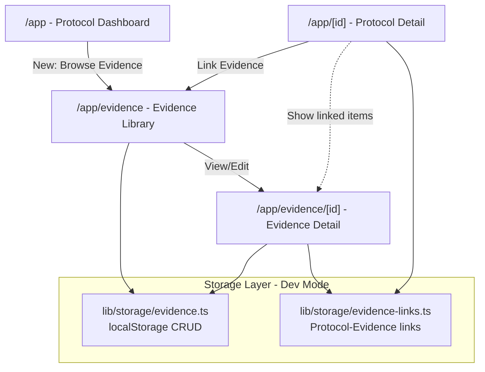
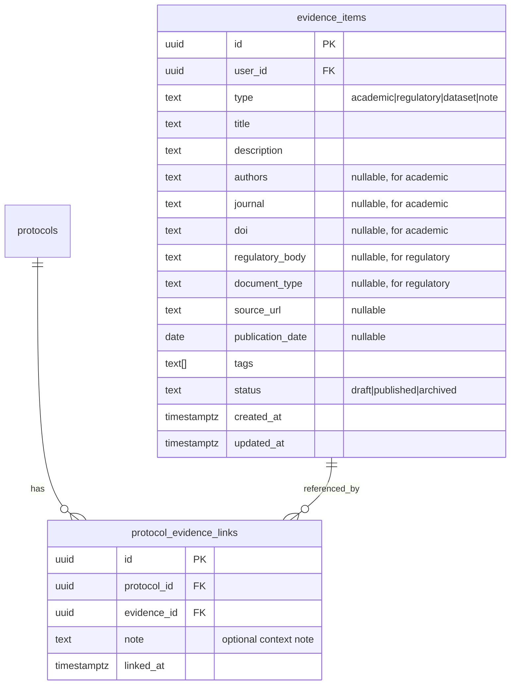

# Evidence Library MVP Implementation

## Overview

Build the Evidence/Insight Library as the second core feature of VaxEvidence. This library will allow researchers to browse, search, filter, and link curated vaccine evidence to their study protocols.

## Architecture

## Database Schema (for future Supabase migration)

## Implementation Steps

### 1. Data Models & Storage Layer

**Files to create:**

- [`lib/storage/evidence.ts`](lib/storage/evidence.ts) - localStorage CRUD for evidence items
- [`lib/storage/evidence-links.ts`](lib/storage/evidence-links.ts) - manage protocol-evidence relationships
- [`lib/validators/evidence.ts`](lib/validators/evidence.ts) - Zod schemas for evidence forms

**Key types:**

- `EvidenceType`: "academic" | "regulatory" | "dataset" | "note"
- `EvidenceItem`: base interface with optional fields for different types
- `EvidenceLink`: protocol_id, evidence_id, note, linked_at

**Seed data:** 15-20 realistic vaccine evidence items (COVID-19, influenza, safety studies, regulatory guidance)

### 2. Evidence Library UI - List View

**File to create:** [`app/app/evidence/page.tsx`](app/app/evidence/page.tsx)

**Features:**

- Grid/list view of all evidence items
- Advanced search bar (text search across title, description, authors)
- Filter sidebar:
  - Evidence type (academic, regulatory, dataset, note)
  - Tags (multi-select)
  - Date range picker
  - Status filter
- Sort options: newest, oldest, title A-Z
- Pagination or infinite scroll (15 items per page)
- "Add Evidence" button → new evidence page
- Each card shows: type badge, title, snippet, tags, date

### 3. Evidence Detail & Edit Page

**File to create:** [`app/app/evidence/[id]/page.tsx`](app/app/evidence/[id]/page.tsx)

**Features:**

- View mode: display all evidence fields
- Edit mode: dynamic form based on evidence type
  - Academic: title, abstract, authors, journal, DOI, publication_date, tags
  - Regulatory: title, summary, regulatory_body, document_type, date, tags
  - Dataset: title, description, source_url, date, tags
  - Note: title, description, tags
- Type selector changes available fields
- Status dropdown (draft, published, archived)
- Delete button with confirmation
- "Linked Protocols" section showing where this evidence is used
- "Link to Protocol" button → protocol selector modal

### 4. New Evidence Creation Page

**File to create:** [`app/app/evidence/new/page.tsx`](app/app/evidence/new/page.tsx)

**Features:**

- Same form as edit page but for creation
- Type selector at top
- Smart defaults based on type
- "Create & Link to Protocol" option

### 5. Protocol-Evidence Integration

**Files to update:**

- [`app/app/[id]/page.tsx`](app/app/[id]/page.tsx) - add "Linked Evidence" section
- [`app/app/page.tsx`](app/app/page.tsx) - add navigation link to Evidence Library

**Protocol detail page additions:**

- "Linked Evidence" card below protocol form
- Shows list of linked evidence items (type badge, title, link)
- "Add Evidence" button → opens evidence selector modal
- Each linked item has "Remove link" and optional note field
- Evidence selector modal:
  - Search/filter interface
  - Select multiple items
  - Add context note for each link

### 6. Navigation & Layout Updates

**Files to update:**

- [`app/app/layout.tsx`](app/app/layout.tsx) - add shared navigation bar for /app routes

**Add navigation:**

- Dashboard | Evidence Library | Profile/Settings
- Breadcrumb support for deep pages

### 7. Supabase Preparation (for future production migration)

**File to create:** [`lib/supabase/evidence.ts`](lib/supabase/evidence.ts)

Implement Supabase queries (mirroring localStorage functions):

- `fetchEvidenceItems()`, `fetchEvidenceById()`, `createEvidence()`, `updateEvidence()`, `deleteEvidence()`
- `linkEvidenceToProtocol()`, `unlinkEvidence()`, `getLinkedEvidence()`

**Note:** Keep using localStorage for now, but prepare async/await patterns.

## UI Components to Build

Using existing shadcn/ui components where possible:

- `EvidenceCard` - reusable evidence item card
- `EvidenceFilters` - filter sidebar component
- `EvidenceTypeSelector` - radio group for evidence types
- `ProtocolEvidenceLinkModal` - modal for linking evidence to protocols
- `LinkedEvidenceList` - display linked evidence on protocol pages

## Technical Considerations

1. **Search implementation:** Client-side filtering for dev (localStorage), prepare for server-side Supabase text search
2. **Tags:** Simple string array, suggest common vaccine-related tags in UI
3. **Date handling:** Use `date-fns` for formatting (already in dependencies)
4. **Form validation:** Conditional Zod schemas based on evidence type
5. **State management:** React hooks + localStorage, no global state needed yet
6. **Link context notes:** Optional field to explain why evidence is relevant to protocol

## Testing Checklist

- Create evidence of each type (academic, regulatory, dataset, note)
- Search by text, filter by type, filter by tags, filter by date range
- Link evidence to protocol, view from protocol page
- Unlink evidence, verify it remains in library
- Edit evidence, verify linked protocols still work
- Delete evidence, handle orphaned links gracefully
- Seed data loads on first visit

## Future Enhancements (post-MVP)

- AI-powered evidence recommendations for protocols
- Export linked evidence as bibliography
- Import evidence from DOI/PubMed
- Evidence versioning
- Collaborative annotations
- Evidence quality ratings

---

This implementation keeps the dev-first approach (localStorage) while building production-ready patterns for Supabase migration.